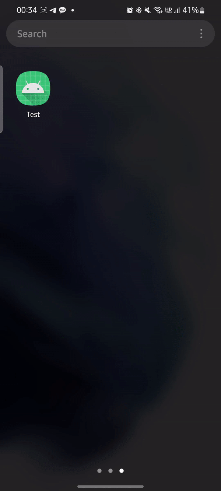

# 인천대학교 앱센터 안드로이드 파트 과제 #1 

본 프로젝트는 인천대학교 앱센터 안드로이드 파트의 첫번째 과제물이며, 아래의 기능들을 구현했습니다.

## Features
- Intent 전환
- SplashScreen (Required API: S)
- RecyclerView

## Additional Feature
### Animated Vector Drawable
ObjectAnimator를 이용해 스플래시 스크린에서 나오는 아이콘에 애니메이션을 추가했습니다.

VectorMator 앱을 이용해 팔의 각도를 다르게 한 두 벡터 이미지를 그린 다음 팔 요소의 벡터 데이터를 ObjectAnimator를 이용해 보간하게끔 했습니다.

